# Obsah prezentace

- Firma EcoHome a.s. a cíl projektu
- Definovaná KPI (GDR, PLC, DQS)
- Architektura datové platformy
- Zdroje dat a DuckDB
- Klíčová zjištění EDA (7 grafů)
- Limity řešení a doporučení
- Metodika a využití AI

# EcoHome a.s. — fiktivní zadavatel

- Firma zabývající se **optimalizací energetické spotřeby domácností** s fotovoltaickými panely.
- Provozuje síť smart meterů (senzorů spotřeby a výroby) v **1 000 domácnostech** v Praze.
- Chce na základě dat navrhnout:
  - cílenou optimalizaci nákladů ve špičce,
  - predikci závislosti na síti podle počasí,
  - detekci vadných senzorů.

# Cíl projektu

Navrhnout a realizovat datový produkt pokrývající **celý mini-lifecycle dat**:

1. Získání zdrojových dat (meteo + smart meter).
2. Integrace do analytické databáze (DuckDB).
3. Explorační analýza (EDA) navázaná na KPI.
4. Vizualizace a interpretace zjištění.
5. Doporučení pro další rozvoj.

# Definovaná KPI

| KPI | Název | Definice |
|-----|-------|----------|
| **GDR** | Grid Dependency Ratio | `1 − (solární výroba / spotřeba)` — závislost na síti |
| **PLC** | Peak Load Cost | Náklady ve špičce (18:00–21:00) při 5 CZK/kWh |
| **DQS** | Data Quality Score | Podíl validních měření ze senzorů |

Každý graf v notebooku je **přímo navázán** alespoň na jedno KPI.

# High-level architektura

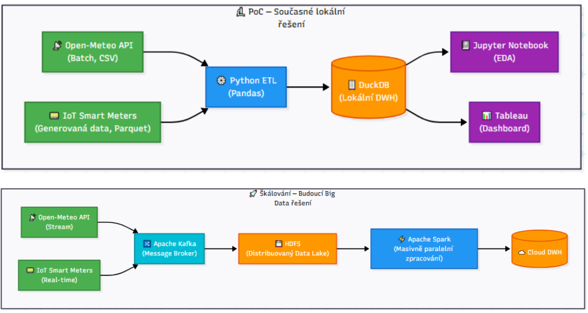

# Datový tok

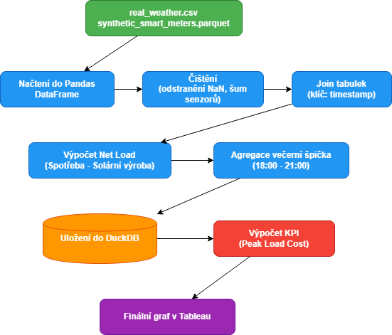

# Zdroje dat

- **Reálná meteorologická data** — Open-Meteo Archive API
  - Praha, rok 2023, hodinová granularita
  - teplota, oblačnost, srážky, vítr, solární iradiace
- **Syntetická smart meter data** — vlastní generátor `generate_data.py`
  - 1 000 domácností × 8 760 hodin ≈ **8,76 mil. záznamů**
  - realistické vzory: kachní křivka, sezónnost, korelace s počasím, šum, výpadky
- Oba zdroje propojeny přes `timestamp` v DuckDB (view `v_net_load`).

# DuckDB — tabulky projektu

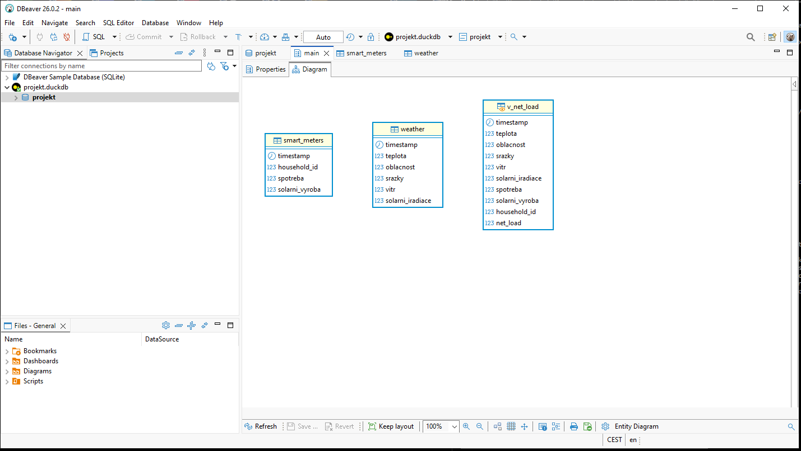

# DuckDB UI — přehled dat

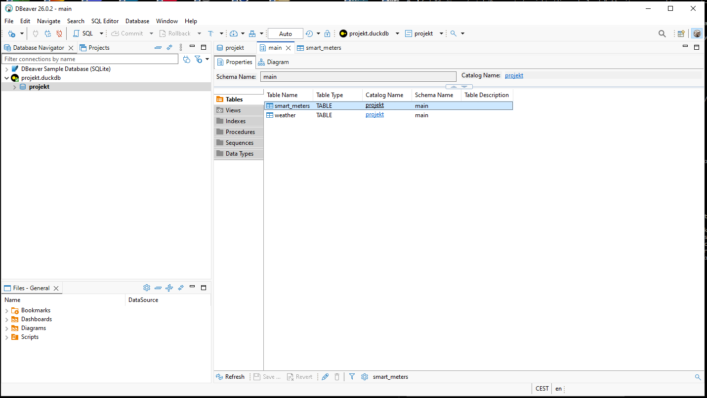

# DuckDB UI — dotazy nad daty

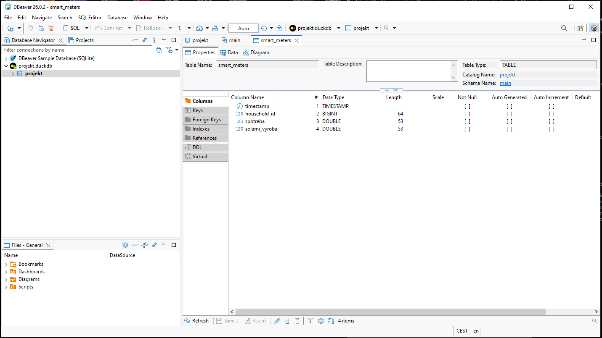

# DuckDB UI — analytický pohled

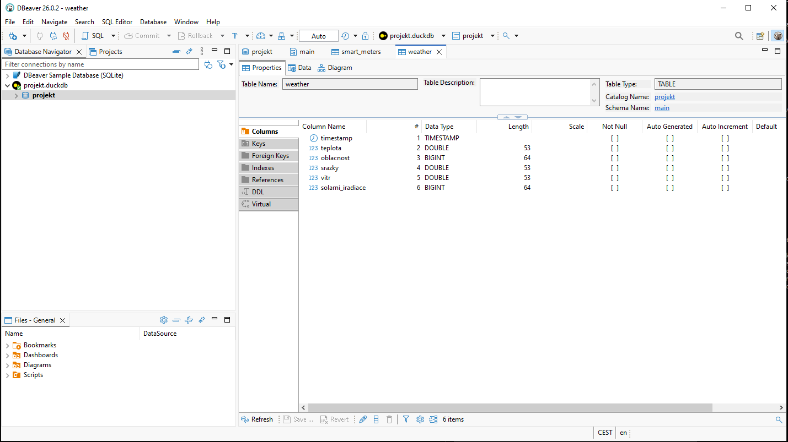

# Graf 1 — Vývoj GDR v čase

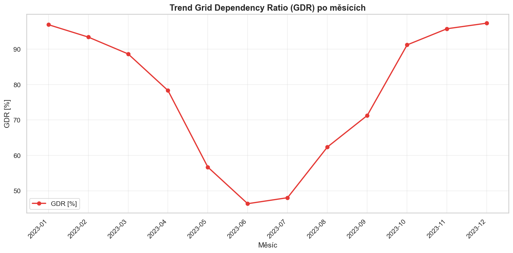

**Zjištění:** silná sezónnost — v létě pod 60 %, v zimě 90–95 %. → KPI: GDR

# Graf 2 — Oblačnost vs. solární výroba

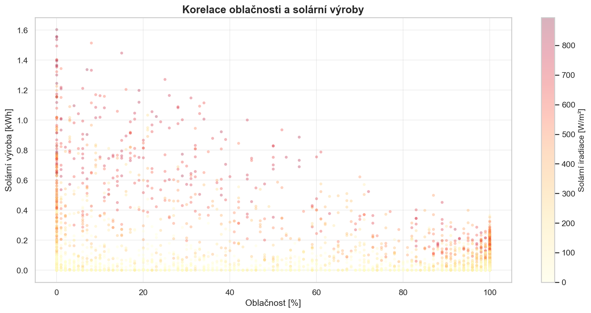

**Zjištění:** inverzní vztah. Nad 80 % oblačnosti je výroba blízká nule. → KPI: GDR

# Graf 3 — Kachní křivka (denní profil)

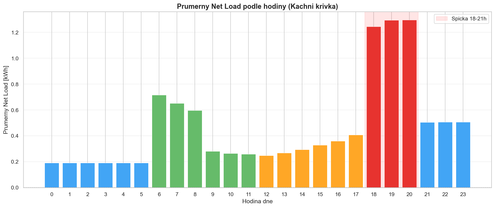

**Zjištění:** večerní špička 18:00–21:00 generuje nejvyšší net load. → KPI: PLC

# Graf 4 — Distribuce PLC

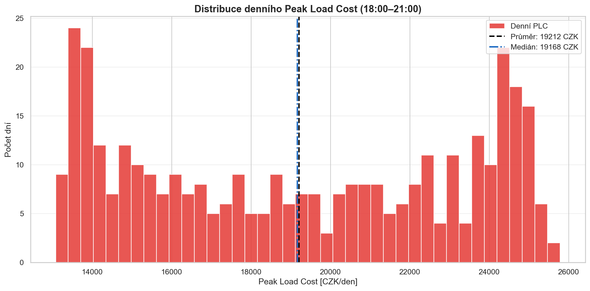

**Zjištění:** pravý chvost — existují dny s extrémně vysokými náklady ve špičce. → KPI: PLC

# Graf 5 — Outliery ve spotřebě

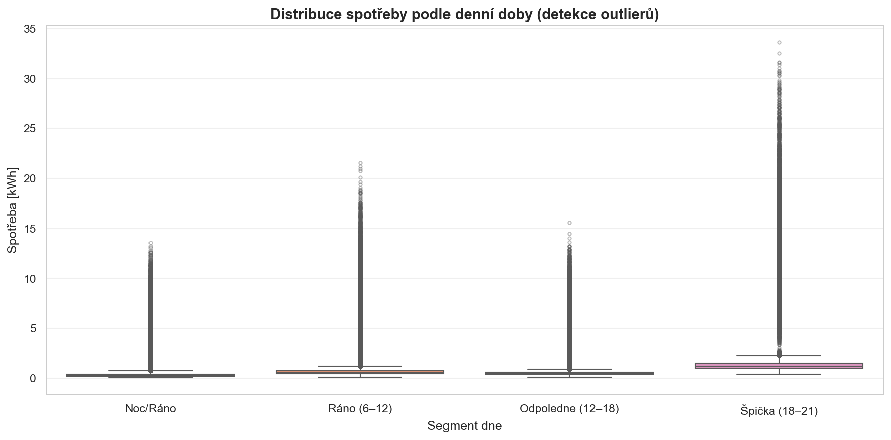

**Zjištění:** ~0,5 % extrémních hodnot, 5–15× normálu. Nutná filtrace. → KPI: DQS

# Graf 6 — Vývoj DQS v čase

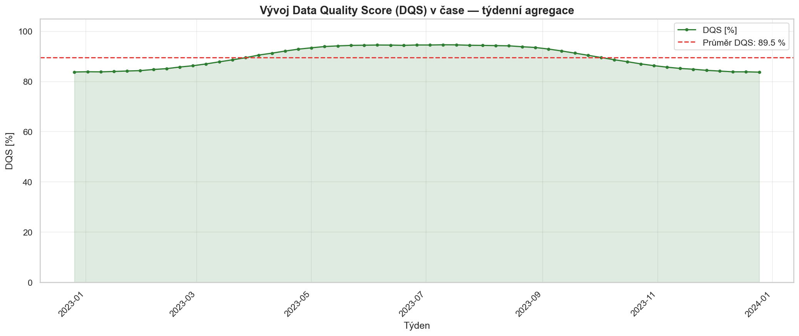

**Zjištění:** průměrně nad 90 %, ale s kolísáním. ~5 % výpadků. → KPI: DQS

# Graf 7 — Spotřeba (log. škála)

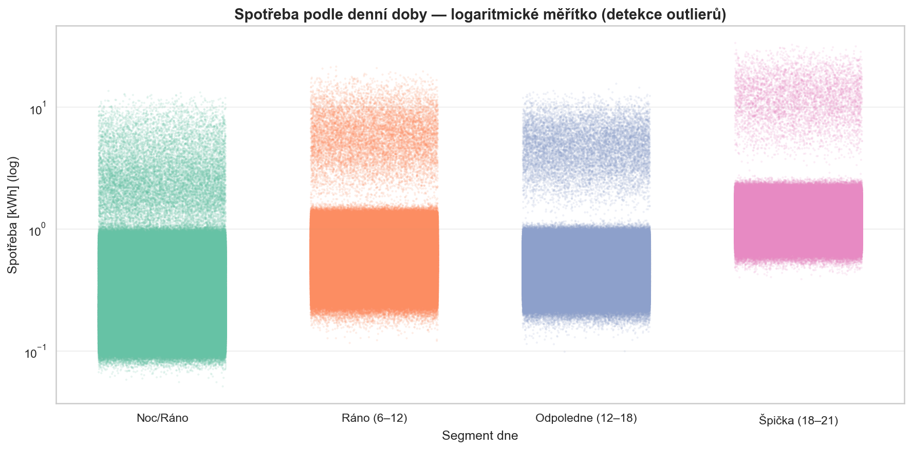

**Zjištění:** log-normální charakter. Medián × průměr se výrazně liší.

# Shrnutí klíčových zjištění

1. **GDR** má silnou sezónnost — domácnosti jsou závislé na síti hlavně v zimě.
2. **Večerní špička (18–21 h)** potvrzuje kachní křivku — cíl pro baterie / posun spotřeby.
3. **Oblačnost** je klíčový prediktor solární výroby.
4. **Senzory**: ~5 % výpadků a ~0,5 % outlierů → DQS průměr > 90 %.
5. **PLC** je vysoce variabilní — pravý chvost distribuce.

# Limity řešení

- **Syntetická data** — nezachycují reálné chování (cena, dovolené, klimatizace).
- **Jedna lokalita (Praha)** — nepřenositelné na jiné regiony.
- **Časový rozsah 1 rok** — bez meziročních trendů.
- **Uniformní domácnosti** — reálná populace je heterogenní.
- **Zjednodušený tarif** — fixní 5 CZK/kWh místo dynamické tarifní struktury.
- **INNER JOIN** — nezohledňuje časové posuny mezi zdroji.

# Doporučení a budoucnost

- **Predikce spotřeby** — Prophet / LSTM pro optimalizaci nákupu elektřiny.
- **Automatická detekce anomálií** — Isolation Forest / autoencoder místo IQR.
- **Dynamické KPI prahy** — adaptivní cíle podle sezóny a počasí.
- **Škálování** — přechod z DuckDB na Spark / cloud DWH při statisících domácností.
- **Interaktivní dashboard** — Tableau / Grafana pro operativní monitoring.

# Metodika a využití AI

- Realizováno s asistencí **Claude Code** (návrh architektury, generování kódu, review EDA).
- Veškerý kód **zkontrolován a upraven týmem**.
- **Open-Meteo** data ověřena proti ČHMÚ; syntetická data proti profilům CEPS / ERÚ.
- Každá buňka notebooku manuálně spuštěna a výstup zkontrolován.
- Rizika AI: přeučení na syntetických datech, bias, black-box → nutný monitoring driftu a human-in-the-loop.

# Rozdělení rolí

| Člen týmu | Role | Hlavní odpovědnost |
|-----------|------|-------------------|
| xhero003 | Data engineer | Získání dat, DuckDB, ETL |
| xherp003 | Data analyst | EDA, vizualizace, Jupyter |
| xvebv002 | Architekt & dokumentace | Architektura, HTML dokument, prezentace |

# Děkujeme za pozornost

**Otázky?**

Repozitář odevzdání: `FINAL/xhero003-xherp003-xvebv002/`

- `jupyter-notebook/` — EDA notebook
- `databaze-duckdb/` — připravená DuckDB databáze
- `raw-data/` — zdrojová data
- `pruvodni-dokumentace/` — HTML + grafy + diagramy
